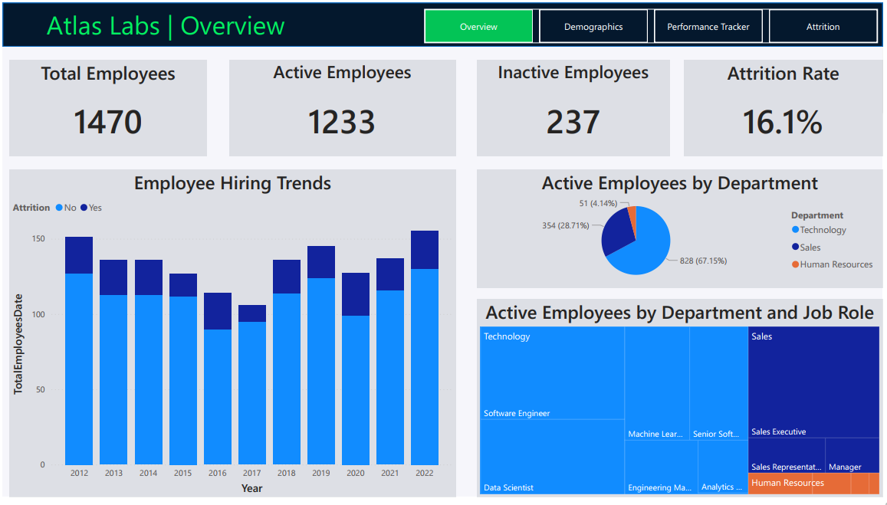
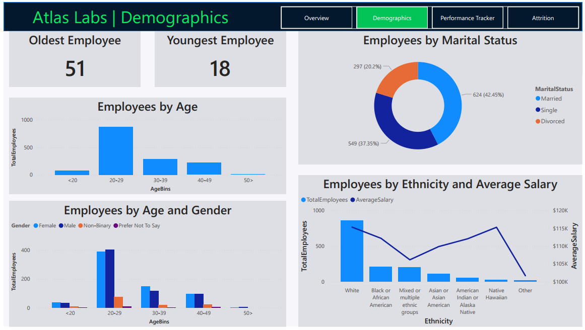
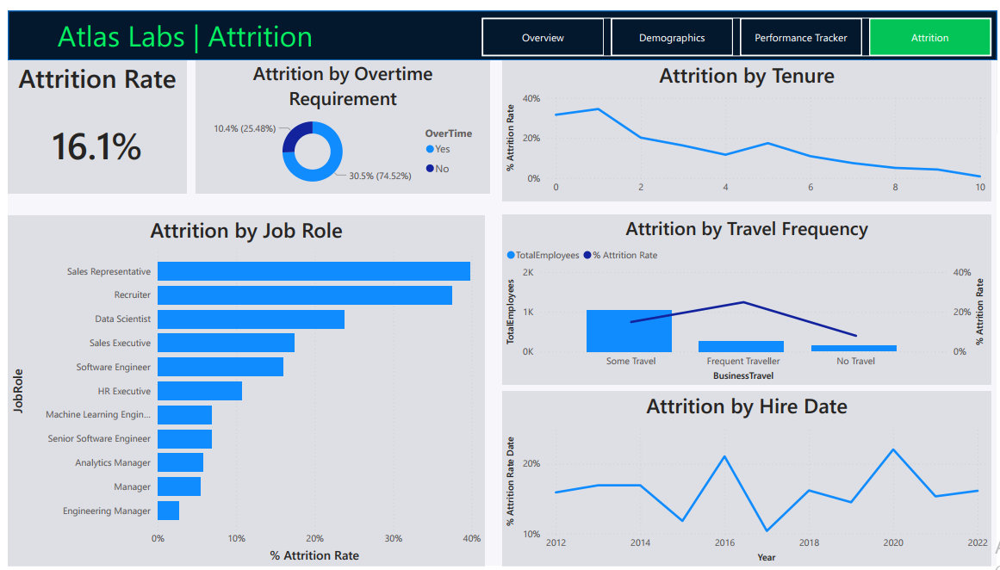
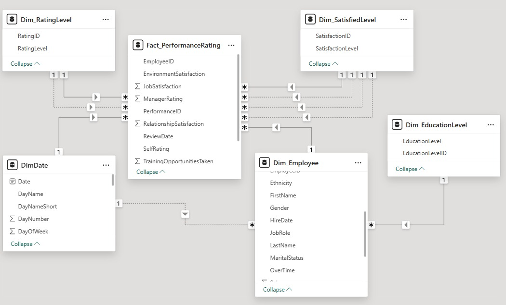

# 🏢 Atlas Labs HR Analytics | Power BI Dashboard


## 📌 Project Overview

An end-to-end HR Analytics case study built as part of the **DataCamp Data Analyst in Power BI Career Track**.

The goal was to answer two core business questions:
- 🎯 **Monitor Key HR Metrics on Employees**
- 🎯 **Understand What Factors Impact Attrition**

---

## 🎬 Dashboard Demo

Here in the assets folder
https://github.com/AliElsabaa/atlas-labs-hr-analytics/blob/main/assets/Demo.mp4

---

## 📊 Report Pages

### 1️⃣ Overview
Key KPIs include Total Employees (1,470), Active Employees (1,233), Inactive Employees (237), and Attrition Rate (16.1%). Includes hiring trends from 2012 to 2022 and employee distribution by department and job role.



### 2️⃣ Demographics
Deep dive into workforce demographics covering age distribution, gender breakdown, marital status, and ethnicity versus average salary.



### 3️⃣ Performance Tracker
Individual employee performance tracking over time, including satisfaction metrics across Work-Life Balance, Job, Environment, and Relationship — alongside Self Rating vs. Manager Rating year-over-year.


### 4️⃣ Attrition Analysis
Identifying attrition drivers by Job Role, Tenure, Travel Frequency, Hire Date, and Overtime requirement.



---

## 🗄️ Data Model

Star Schema with **1 Fact Table** and **5 Dimension Tables**:

| Table | Type | Description |
|-------|------|-------------|
| `Fact_PerformanceRating` | Fact | Core performance & satisfaction metrics |
| `Dim_Employee` | Dimension | Employee demographics & attributes |
| `Dim_RatingLevel` | Dimension | Rating scale (1–5) |
| `Dim_SatisfiedLevel` | Dimension | Satisfaction scale (1–5) |
| `Dim_EducationLevel` | Dimension | Education classification |
| `DimDate` | Dimension | Date table generated via DAX code |



**Key Modeling Decisions:**
- Applied **Role-Playing Relationships** using Active & Inactive Relationships with `USERELATIONSHIP()`
- All DAX measures are organized in a dedicated `_Measures` table for a cleaner project structure
- Date Dimension Table created using a pre-built DAX script and connected to the model

---

## 🔧 Skills Applied

| Skill | Details |
|-------|---------|
| Data Transformation | Type validation and preprocessing based on metadata file |
| Data Modeling | Star Schema design with Role-Playing Relationships |
| DAX | Calculated measures using CALCULATE, FILTER, DISTINCTCOUNT, USERELATIONSHIP, and more |
| Visualization | Multi-attribute visuals with cross-page storytelling |
| Report Design | 4-page interactive dashboard with navigation |

---

## 📁 Project Structure

```
atlas-labs-hr-analytics-powerbi/
│
├── Atlas_Labs_HR.pbix
├── README.md
├── screenshots/
│   ├── Overview.png
│   ├── Demographics.png
│   ├── Performance_Tracker.png
│   └── Attrition.png
└── data_model/
    └── Data_Model.png
```

---

## 🎓 Context

Built as part of the [DataCamp Data Analyst in Power BI Career Track](https://www.datacamp.com/tracks/data-analyst-in-power-bi) — End-to-End Project (Case Study HR Analytics in Power BI).

---

## 📬 Connect

[](https://www.linkedin.com/in/ali-elsabaa-a4b757219/)
